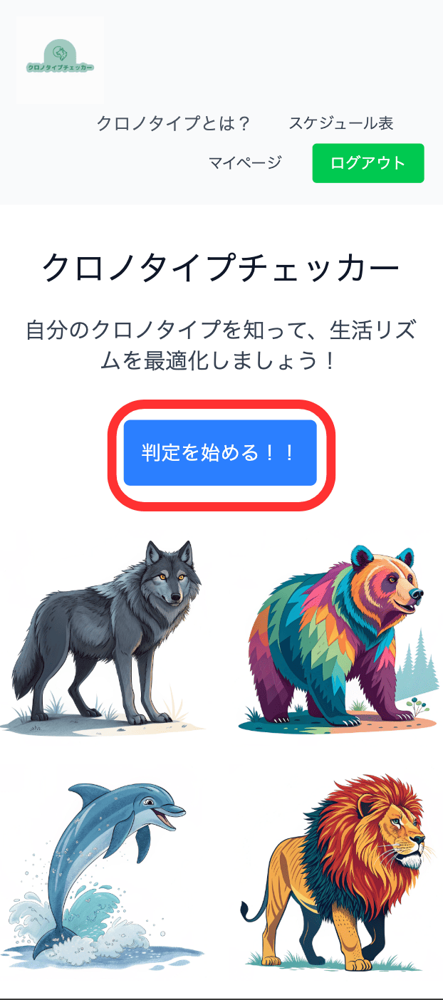
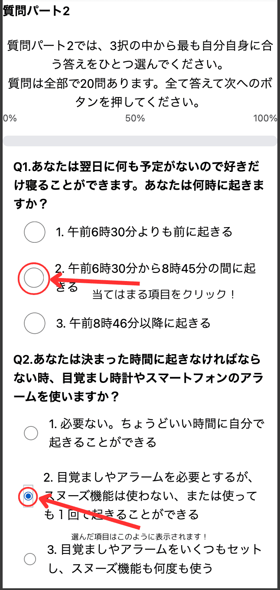
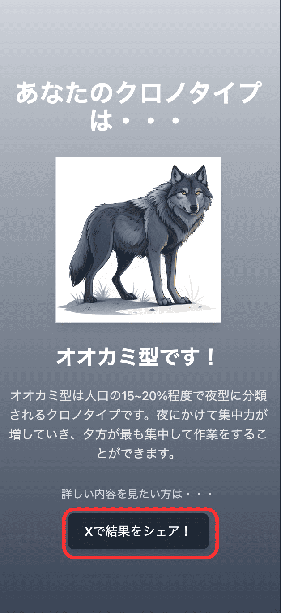
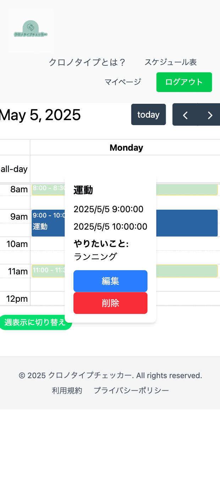

# サービス名：　クロノタイプチェッカー
 

## サービスURLとgest user
### https://chronotype-checker.com/

### gest user(判定機能はログイン無しでもお使いいただけます。）
   メールアドレス: gest@gmail.com
   パスワード: gestuser

  ## サービスの利用イメージ 
  
| 1. Topページ|2.質問に答える|
|   :---: | :---: |
| | |
| 判定を始めるを押すとクロノタイプの判定を 始めることができます | ２択もしくは3択の質問に回答してください |
|3. 結果を表示|4.スケジュール表を表示|
| | |
|計30問（イルカ型のみ10問）回答が終わると結果が表示されます。|新規登録、もしくはログインをしているとご自身のクロノタイプに合ったスケジュール表を表示します。|

## サービス概要
　このサービスは、2択または3択の質問に答えることでクロノタイプ（体内時計）を判定し、判定結果に基づいた予定表を作成することができます。自分のクロノタイプを知ることで自分に合った生活周期を把握でき、最適な睡眠時間や学習・仕事の効果的な時間帯を設定することで生産性を向上させることができます。 そして、これらを予定表として可視化することで日々の生活と結びつけ習慣づけることを促すことができます。

## サービス開発の背景 
　私はこれまでの人生で朝活に挑戦しては失敗し、その度にネガティブな気持ちになっていました。そのような状況を改善しようと早起きする方法探し、色々試したけどどれもうまくいかずでした。そんな中、たまたまクロノタイプ診断に出会い、診断をしてみたところ自分が夜型（オオカミ型）だと判明しました。この時に朝早く起きることが自分の体内時計に合っていないと知り、今まで早く起きれられなかったことや早く起きても作業に集中できない原因が分かり心が軽くなりました。クロノタイプを知ってから体内時計に合わせた予定を立て、その予定に合わせて行動するようになってから作業効率も上がり、自信を持って学習に取り組めるようになりました。
 　過去の私と同じように朝早く起きれずに悩んでいる方や、夜になるとどうしても眠たくなって作業ができない方にクロノタイプを知ってもらい、自分の体内時計に合った生活を送ってもらいたいと思い、このサービスを開発しました。

## ターゲットユーザー 

### 中学生～高校生 
 自身のクロノタイプを理解することで、進路選択の参考にしてもらいたい。 
 

### 20代～40代のリスキリングや学習に取り組むビジネスパーソン 
 単に早起きして学習時間を確保するのではなく、個人の最適な時間帯を把握し、効率的に学習を進めてもらいたい。

## ユーザー獲得について 
 SNSでの宣伝 判定結果をX（旧Twitter）でリンク付きでポストできる機能を実装 ソーシャルポートフォリオへの掲載 RUNTEQコミュニティのtimesなどに掲載

## サービスの差別化ポイント 
 ・クロノタイプに特化した診断をするという点 
 ・判定結果から予定表を作成するという機能を実装している点

## 使用技術
| カテゴリ | 技術内容 |
| --- | --- | 
| サーバーサイド | Ruby on Rails 7.2.1・Ruby 3.3.6 |
| フロントエンド | Ruby on Rails・JavaScript |
| CSSフレームワーク | Tailwindcss  |
| Web API | Google API(OAuth 2.0) |
| データベースサーバー | PostgreSQL |
| デプロイ | Render |
| バージョン管理ツール | GitHub・Git Flow |
 

## ER図

 

## 本サービスを作成するにあたって参考にした文献 
・マイケル・ブレウス.訳 長谷川 圭.The Power of When Discover Your Chronotype 最良の効果を得るタイミング.パンローリング株式会社 2020年初版 
 ・マイケル・ブレウス .SLEEP QUIZ.SLEEP DOCTOR https://shop.sleepdoctor.com/pages/at-home-sleep-apnea-test?_gl=1*9kt6ff*_gcl_au*MTUxODM1NDU1MS4xNzM4OTI4NTAz
